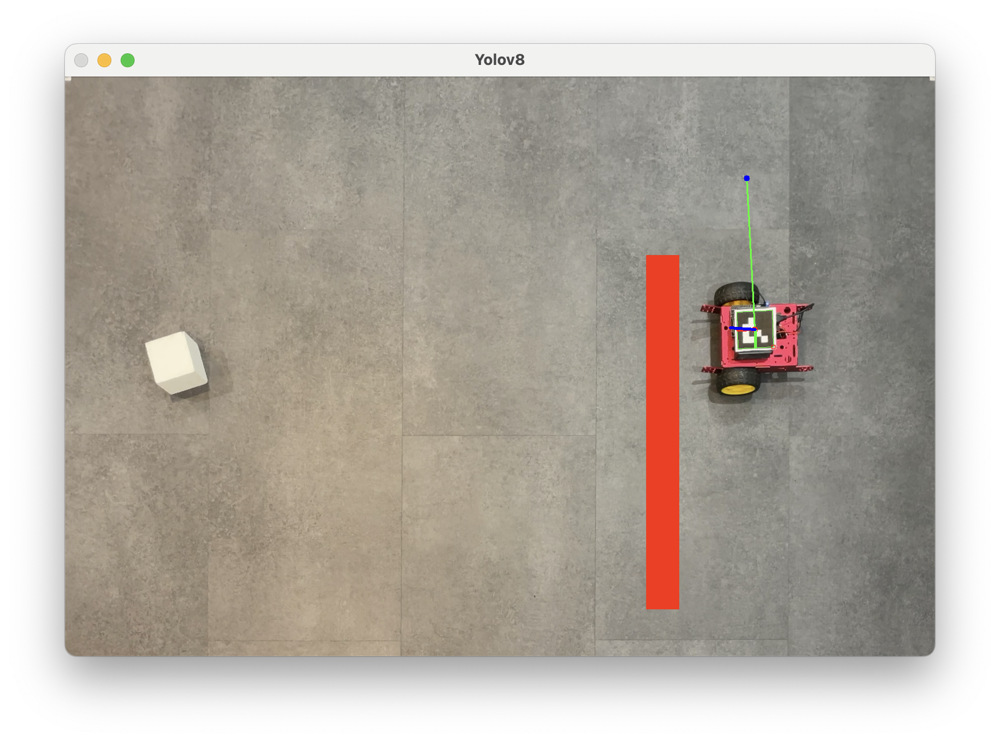
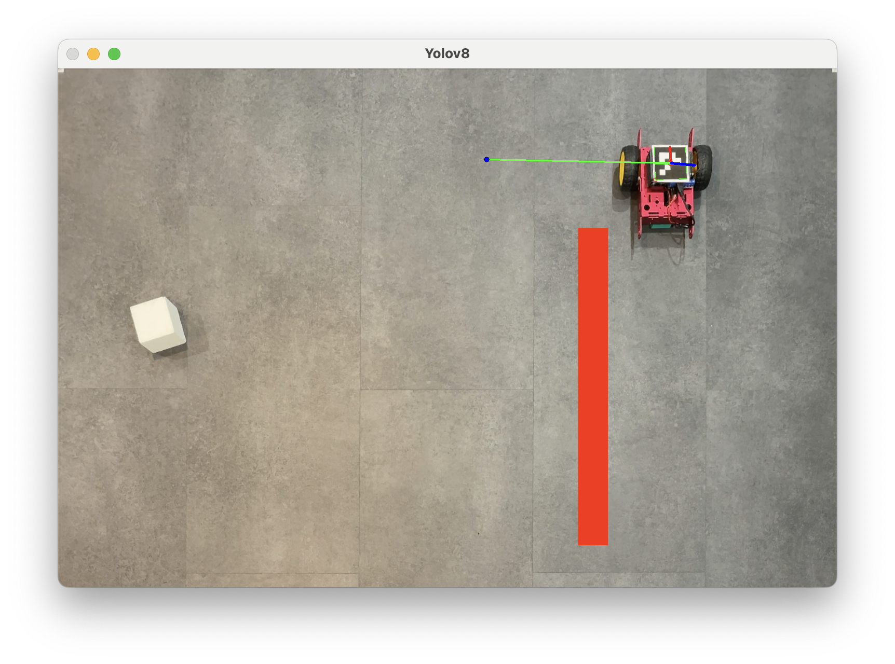
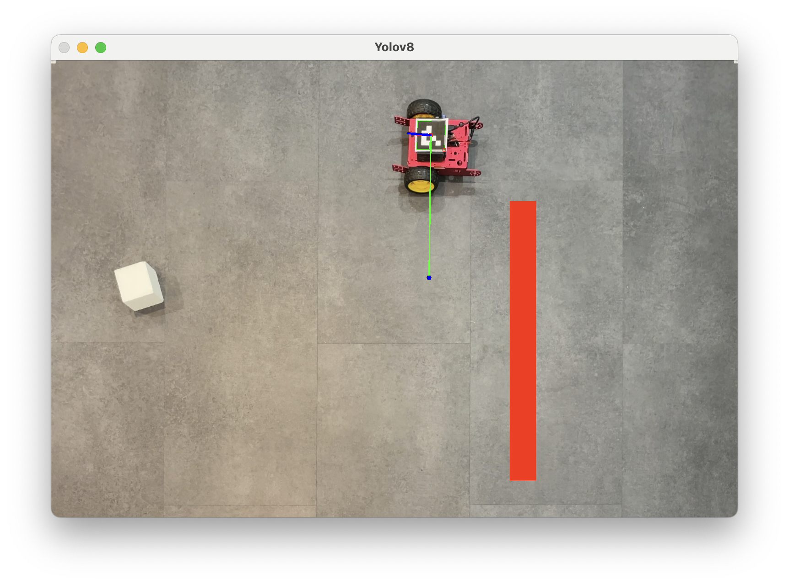
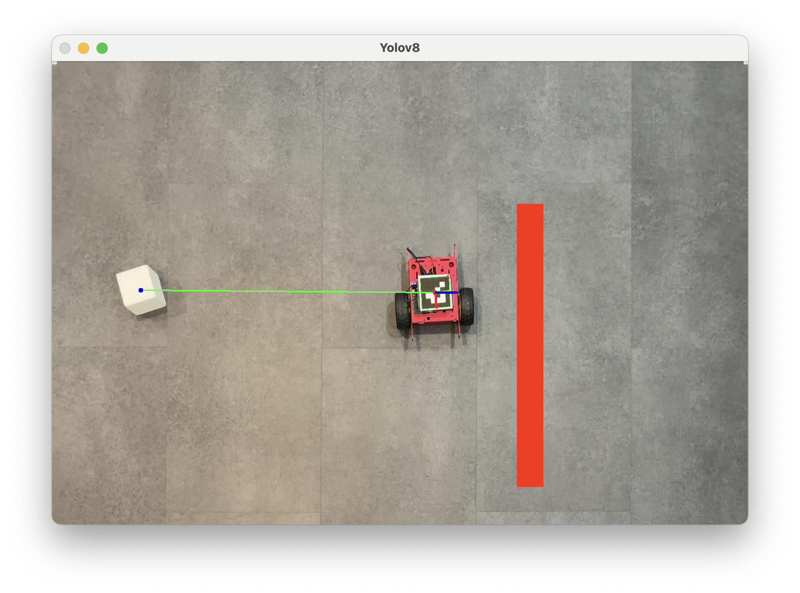
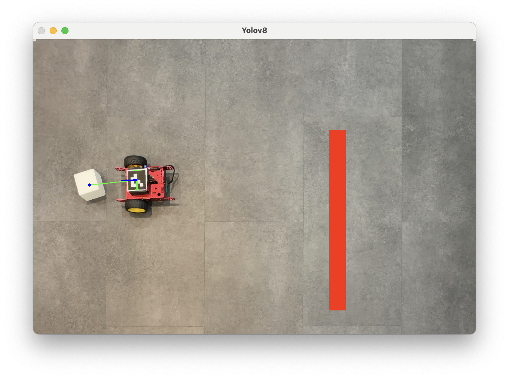

# Logistics Robot Project

This project aims to develop an autonomous robotic system capable of locating and transporting specific objects to predefined areas on a map.

Challenge: Succeeding in processing real-time data.

## Installation

### Prerequisites

- [Training YOLOv8 Model with Google Colaboratory](#training-yolov8-model-with-google-colaboratory)
- Python 3.9
- Required Python libraries (numpy, requests, networkx, OpenCV 4.5.4.60)
- ESP8266 with [specific configuration]

### Installing Dependencies

1. Clone this repository:

   ```bash
   git clone https://github.com/your-username/your-project.git
   cd your-project

   
2. Install Python dependencies :
    ```bash
   pip install -r requirements.txt

3. Create a "Model" file
   - Import your recognition model (name it "best.pt").
   - To test the model, run the script modelDetectionTest.py:
    ```bash
   python Test/modelDetectionTest.py

4. Map Creation

Size: 1.50m x 1m


5. Camera Calibration

Ensure your camera is properly calibrated to minimize distortions and improve the accuracy of ArUco marker detection.
- Print a 7x5 chessboard
- Place the chessboard in various positions and orientations (Calibration/getImages.py)
- Run the calibration script
    ```bash
       python Calibration/calibration.py
- Export the results to Perception/mapDetectionFromIMG/mapDetection

6. ESP8266 Initialization

- Communication with the ESP8266 is done via the HTTP protocol.
- [Upload the code to ESP8266](ESP8266/robotExecution.ino)

7. Launch main.py

Remark : If you use a macbook, to use your iphone as a webcam change for this : cap = cv2.VideoCapture(1)

# Training the YOLOv8 Model with Google Colaboratory

## 1. Retrieving data for model training

- Take several photos (100 to 200) from different angles. You can use the `takePhoto.py` script:

  ```bash
  python takePhoto.py


## 2. Annotating images on Roboflow

- Go to: https://app.roboflow.com/
- Click on: "New Project"
- Name your project
- Create a class (e.g., "cube")
- In the "Upload Data" section, upload your previously taken photos
- Annotate each image (outline your object(s) present in the photos)
- For better accuracy, take some photos without objects and do not annotate them
- Then, in "Generate", generate a dataset
- Leave the "Train Split" at 70/20/10
- Preprocess based on desired accuracy (optional)
- Create and export the dataset

## 3. Training the YOLOv8 model

- Download the notebook: https://github.com/roboflow/notebooks/blob/main/notebooks/train-yolov8-object-detection-on-custom-dataset.ipynb
- Go to Google Colaboratory: https://colab.research.google.com/
- Import the notebook
- Connect to the T4 GPU
- Follow the steps in the notebook, ensuring to use the yolov8n.pt model (the lightest one)
- Once the model is trained, download model.pt

Now, you can detect your object in real-time using your webcam

# Testing and Results
- Software testing (each photo represents steps of the A* graph)
- Red line represents an obstacle (fictional here)






- To improve:
The robot's motor does not work in AC, so there is no speed variation (too fast to achieve real-time results).
