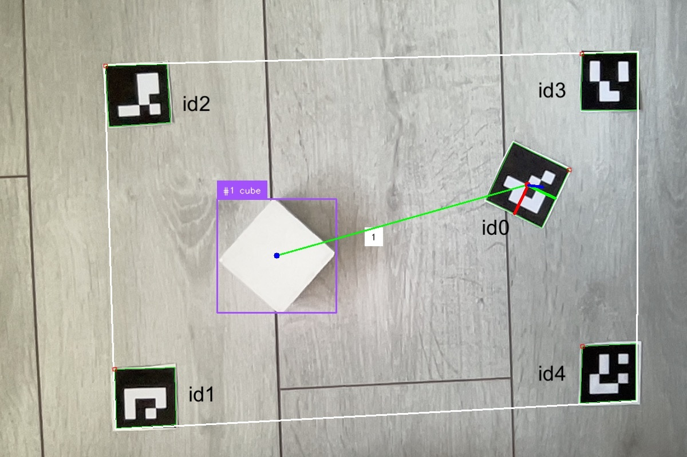

# Projet de Robot Logistique

Ce projet vise à développer un système robotique autonome capable de localiser et transporter des objets spécifiques vers des zones prédéfinies sur une carte.

Enjeu : réussir à traiter les données en temps réel

## Installation

### Prérequis

- [Entraînement du modèle YOLOv8 avec Google Colaboratory](#entraînement-du-modèle-yolov8-avec-google-colaboratory)
- Python 3.9
- Bibliothèques Python nécessaires (numpy, requests, networkx, OpenCV 4.5.4.60)
- ESP8266 avec [configuration spécifique]

### Installation des Dépendances

1. Clonez ce repository :

   ```bash
   git clone https://github.com/votre-utilisateur/votre-projet.git
   cd votre-projet
   
2. Installez les dépendances Python :
    ```bash
   pip install -r requirements.txt

3. Créer un fichier "Model"
   - Importez votre modèle de reconnaissance (nommez-le "best.pt").
   - Pour tester que le modèle marche lancez le script modelDetectionTest.py
    ```bash
   python Test/modelDetectionTest.py

4. Création de la map

Taille : 1m50x1m


5. Calibration de la caméra

Assurez-vous que votre caméra est correctement calibrée pour minimiser les distorsions et améliorer la précision de la détection des marqueurs ArUco.
- Imprimez un chessboard 7x5
- Placez le chessboard dans différentes positions et orientations (Calibration/getImages.py)
- Lancer le script de calibration
    ```bash
       python Calibration/calibration.py
- Exporter les résultats dans Perception/mapDetectionFromIMG/mapDetection

6. Initialisation ESP8266

- La communication avec l'esp8266 ce fait via le protocole HTTP
- [Televerser le code sur esp8266](ESP8266/robotExecution.ino)

  7. Lancez main.py

# Entraînement du Modèle YOLOv8 avec Google Colaboratory

## 1. Récupération des données pour entraîner le modèle

- Prendre plusieurs photos (100 à 200) sous différents angles de vue. Vous pouvez utiliser le script `takePhoto.py` :

  ```bash
  python takePhoto.py

## 2. Annotation des images sur roboflow

  - Rendez-vous sur : https://app.roboflow.com/
  - Cliquez sur : "New Project"
  - Nommez votre projet
  - Créez une classe (exemple : "cube")
  - Dans la section "Upload Data", récupérez vos photos précédemment prises
  - Ensuite, annotez chaque image (délimitez votre/vos objet(s) présent(s) sur les photos)
  - Pour plus de précision, prenez quelques photos sans objets et ne les annotez pas
  - Ensuite, dans "Generate", générez un dataset
  - Laissez le "Train Split" à 70/20/10
  - Prétraitement en fonction de la précision souhaitée (facultatif)
  - Puis créez le dataset et l'exportez

## 3. Entrainement du modèle Yolov8
 
   - Téléchargez le notebook : https://github.com/roboflow/notebooks/blob/main/notebooks/train-yolov8-object-detection-on-custom-dataset.ipynb
   - Rendez-vous sur Google Colaboratory : https://colab.research.google.com/
   - Importez le notebook
   - Connecter le GPU T4
   - Suivez les étapes du notebook en veillant à utiliser le modèle yolov8n.pt (le plus léger)
   - Une fois le modèle entraîné, téléchargez model.pt

On peut maintenant détecter notre object en temps réel via notre webcam

